[TOC]

本文档是 Windows 系统下 git 相关使用方法和流程，包括：安装 git，创建 git 仓库，用命令行 Push 本地仓库至远程、Pull 远程仓库至本地，以及在 VSCode 中集成 Git，使用鼠标点击替换命令行。但不包括多人协同，多分支等相关操作。至于 Linux 系统下安装和配置类似，具体可见[Linux 下 git 使用简明教程](https://github.com/junjiecjj/MarkDown/blob/main/GitTutor.md)。

# 一、下载安装 Git

## 安装 Git

Windows10 用户，前往[Git 官网](https://git-scm.com/downloads)下载 Windows 版本的安装包 Git-2.37.0-64-bit.exe。

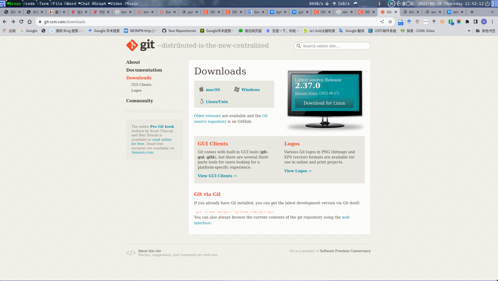

点击`64-bit Git for Windows Setup.`

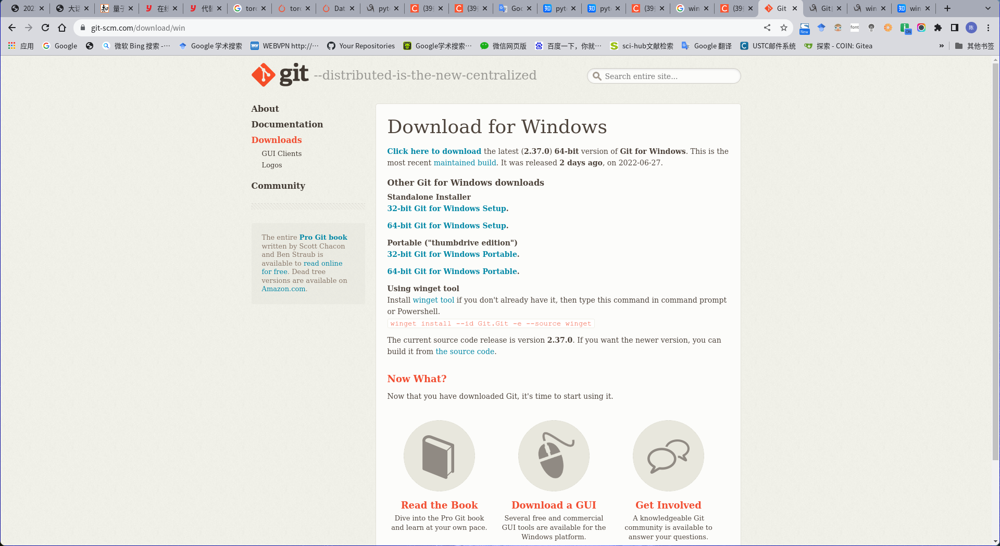

双击下载下来的 Git-2.37.0-64-bit.exe 安装包，流程比较多，一直下一步，期间的一些可选项可参见[Git 自学（1）-- Win10 安装 Git 详细教程（超详细纯小白教程）
](https://www.cnblogs.com/ay2021/p/15023636.html)决定是否选中安装过程中的可选项。

## 配置用户信息

安装完成后，需要在本地配置 Git 的用户信息。

安装完 Git 之后，要做的第一件事就是设置你的用户名和邮件地址。 这一点很重要，因为每一个 Git 提交都会使用这些信息，它们会写入到你的每一次提交中，不可更改,打开命令行或者 PowerShell,依次输入以下，其中的`sysu-desktop`需要改成你想要的名字，`123455667@qq.com`邮箱设置为你常用的邮箱.

```bash
#设置你的git用户名及邮箱
$: git config --global user.name 'sysu-desktop'
$: git config --global user.email '123455667@qq.com'
# 以上两行用于Github识别是哪个git用户提交了代码，也就是给本地仓库Repository取名。
```

再次强调，如果使用了 --global 选项，那么该命令只需要运行一次，因为之后无论你在该系统上做任何事情， Git 都会使用那些信息。 当你想针对特定项目使用不同的用户名称与邮件地址时，可以在那个项目目录下运行没有 --global 选项的命令来配置。

## 添加免密登录(可选)

在为了将本地仓库与远程 Github 或者 GitLab 或者

Linux 系统中，一般为了使用方便，会设置免密登录，如果没有设置，则会每次需要输入账号密码。
Window 系统中，如果使用 CMD/命令行/VSCode，且没有设置免密登录，只有第一次需要输入账号密码，后续使用系统会记住密码。

### 生成密钥

```bash

# 给git添加 ssh-key，查看家目录下是否有.ssh目录，若没有则生成一个ssh-key，
ssh-keygen -t rsa -C "123455667@qq.com"
# 三次回车就好


#如果是Linux系统，这行命令将会在~/.ssh/下生成两个文件：id_rsa  id_rsa.pub
┌─[jack@unix] - [~] - [2021-09-11 12:36:03]
└─[0] cd .ssh
┌─[jack@unix] - [~/.ssh] - [2021-09-11 12:36:05]
└─[0] ll
总用量 20K
drwx------  2 jack jack 4.0K  9月 10 19:46 ./
drwxr-xr-x 86 jack jack 4.0K  9月 11 00:36 ../
-rw-------  1 jack jack 2.6K  9月 10 19:51 id_rsa
-rw-r--r--  1 jack jack  571  9月 10 19:51 id_rsa.pub
-rw-r--r--  1 jack jack 1.8K  9月 10 20:03 known_hosts
┌─[jack@unix] - [~/.ssh] - [2021-09-11 12:36:07]
└─[0]
# id_rsa.pub是可以放到很多台服务器上的，这样本电脑登录这些服务器都会免密。


```

如果是 Windows 系统然后打开~/.ssh/id_rsa.pub 文件(~表示用户目录，比如我的 windows 就是 C:\Users\Administrator)，复制其中的内容。

### 将 ssh 配置到 github 中

点击头像，选择 settings
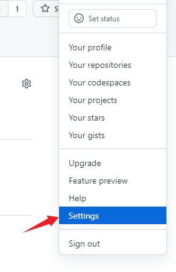

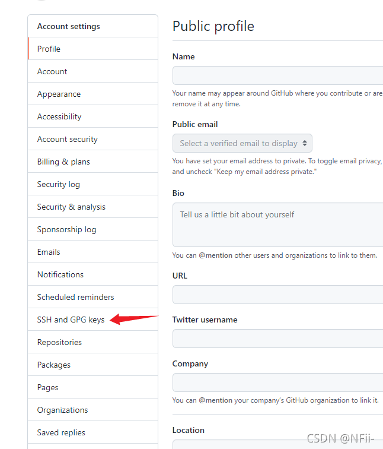

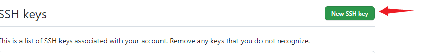

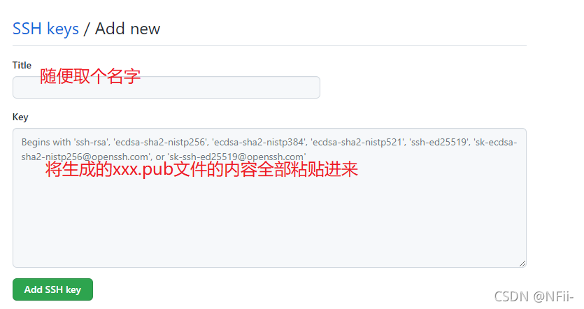

### 检查是否配置成功

```bash
ssh -T git@github.com
```

出现 👇 表示配置成功

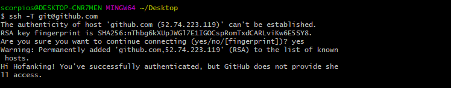

关于 Windows 下免密设置可见[win10 下 git 初始安装及配置工作](https://zhuanlan.zhihu.com/p/138722339)

# 二、 结合远程仓库使用 git

以下情况

## 情况 1：远程无仓库，新建本地仓库并上传

这种情况多半是想在本地文件夹新建一个仓库，然后在这个新仓库里写代码，并提交本地仓库，最后同步到远程仓库。

### 使用 VSCode

- 使用 github 登录 VSCode。
  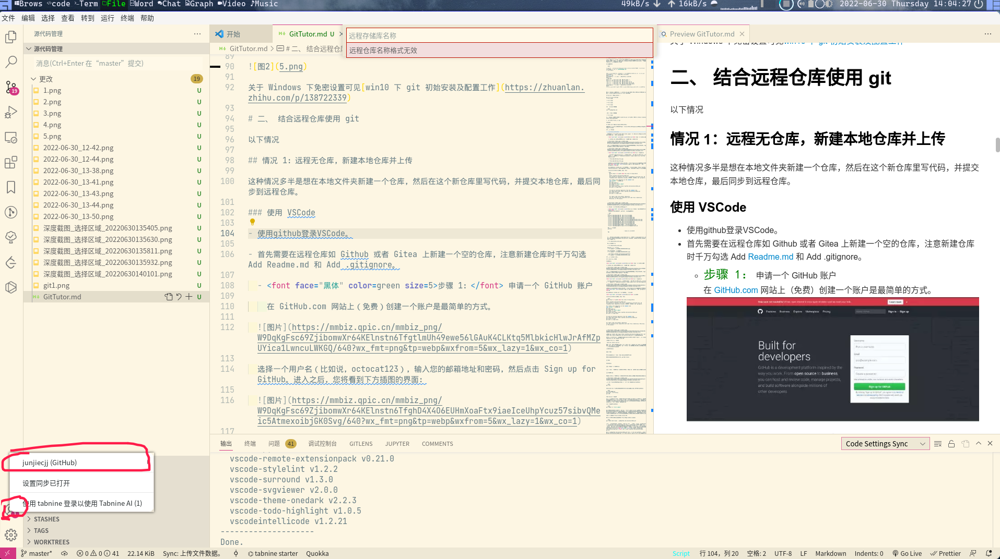

- 在远程仓库如 Github 或者 Gitea 上新建一个空的仓库，注意新建仓库时千万勾选 Add Readme.md 和 Add .gitignore。

- <font face="黑体" color=green size=5>步骤 1：</font> 申请一个 GitHub 账户

  在 GitHub.com 网站上（免费）创建一个账户是最简单的方式。


选择一个用户名（比如说，octocat123），输入您的邮箱地址和密码，然后点击 Sign up for GitHub。进入之后，您将看到下方插图的界面：


- <font face="黑体" color=green size=5>步骤 2：</font>创建一个新的仓库

  一个仓库（ repository），类似于能储存物品的场所或是容器；在这里，我们创建仓库存储代码。在 `+` 符号（在插图的右上角，我已经选中它了） 的下拉菜单中选择 New Repository。

  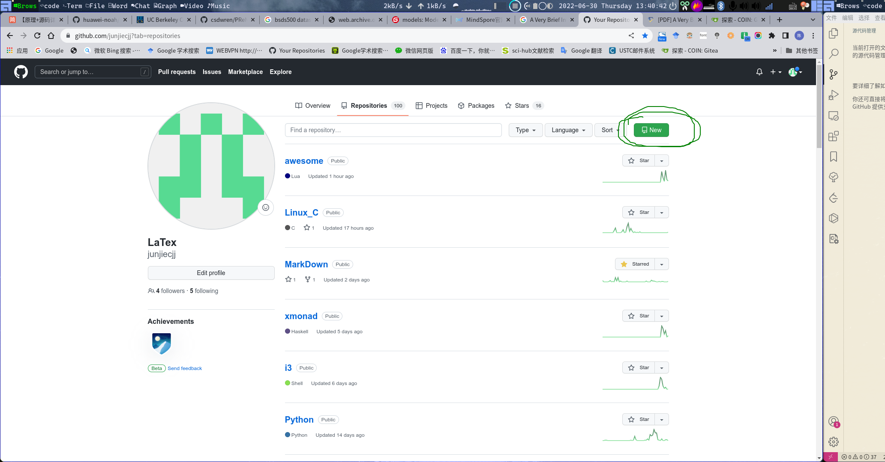

  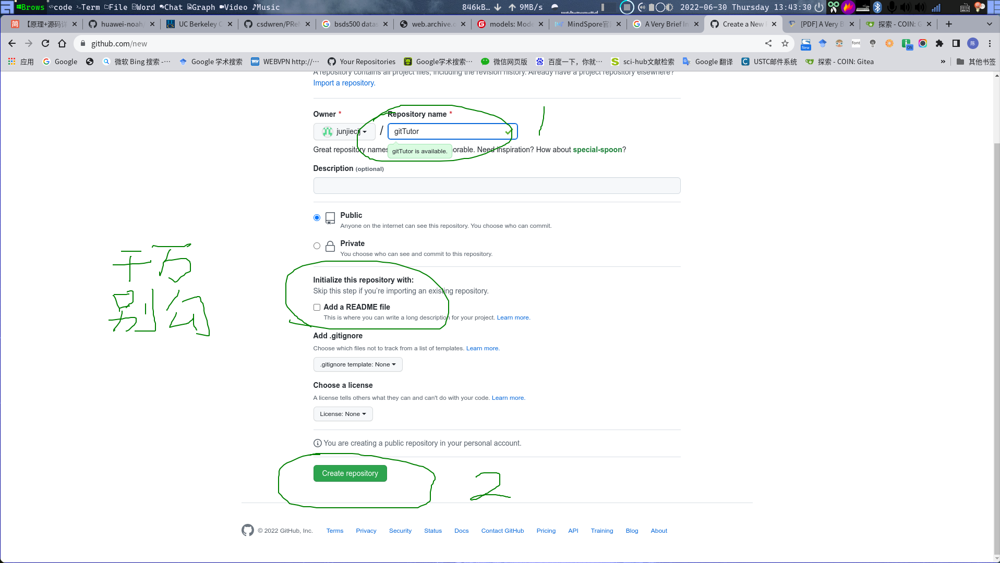

  给您的仓库命名（比如说，Demo）然后点击 Create Repository，无需考虑本页面的其他选项，<font face="黑体" color=red>特别是千万勾选`Add Readme.md`和`Add .gitignore`</font>。

  恭喜！您已经在 GitHub.com 中建立了您的第一个仓库，网址为`https://github.com/junjiecjj/gitTutor`,这个网址后面在 VScode 中或者终端中推送远程仓库时需要用到。

  当仓库创建完毕后，界面将和下方一致：

```bash
    Quick setup — if you’ve done this kind of thing before
    or
    https://github.com/junjiecjj/Demo.git
    Get started by creating a new file or uploading an existing file. We recommend every repository include a README, LICENSE, and .gitignore.

    …or create a new repository on the command line
    echo "# Demo" >> README.md
    git init
    git add README.md
    git commit -m "first commit"
    git branch -M main
    git remote add origin https://github.com/junjiecjj/Demo.git
    git push -u origin main


    …or push an existing repository from the command line
    git remote add origin https://github.com/junjiecjj/Demo.git
    git branch -M main
    git push -u origin main


    …or import code from another repository
    You can initialize this repository with code from a Subversion, Mercurial, or TFS project.

```


- 在 VScode 中初始化本地仓库并推送到远程

  - <font face="黑体" color=green size=5>步骤 1：在 VSCode 中将本地文件夹初始化为仓库</font>
    例如此教程的本地文件夹 `gitTutor` 目录组织如下：

  ```bash
   ❯ ll
   drwxrwxr-x⠀jack⠀jack⠀4.0K  ⠀Jun 30 13:33:33⠀ﱮ⠀.
   drwxr-xr-x⠀jack⠀jack⠀4.0K  ⠀Jun 28 16:14:53⠀ﱮ⠀..
   -rw-rw-r--⠀jack⠀jack⠀17.1K ⠀Jun 30 13:01:22⠀⠀1.png
   -rw-rw-r--⠀jack⠀jack⠀64.6K ⠀Jun 30 13:01:41⠀⠀2.png
   -rw-rw-r--⠀jack⠀jack⠀386.6K⠀Jun 30 12:42:25⠀⠀2022-06-30_12-42.png
   -rw-rw-r--⠀jack⠀jack⠀312.2K⠀Jun 30 12:44:24⠀⠀2022-06-30_12-44.png
   -rw-rw-r--⠀jack⠀jack⠀8.8K  ⠀Jun 30 13:01:52⠀⠀3.png
   -rw-rw-r--⠀jack⠀jack⠀39.0K ⠀Jun 30 13:01:59⠀⠀4.png
   -rw-rw-r--⠀jack⠀jack⠀13.3K ⠀Jun 30 13:16:41⠀⠀5.png
   -rw-rw-r--⠀jack⠀jack⠀140.7K⠀Oct  3 01:09:41⠀⠀git1.png
   -rw-rw-r--⠀jack⠀jack⠀20.4K ⠀Jun 30 13:34:49⠀⠀GitTutor.md

   ╭─   ~/公共的/gitTutor                                                                                                                                                                        base at  13:35:04
   ╰─❯


  ```

  打开 VSCode，依次：文件 $\longrightarrow$ 打开文件夹 $\longrightarrow$ 选择 gitTutor 文件夹，这时候可以看到 gitTutor 目录下的所有文件，然后点击左边的`初始化存储库`，如下图：

  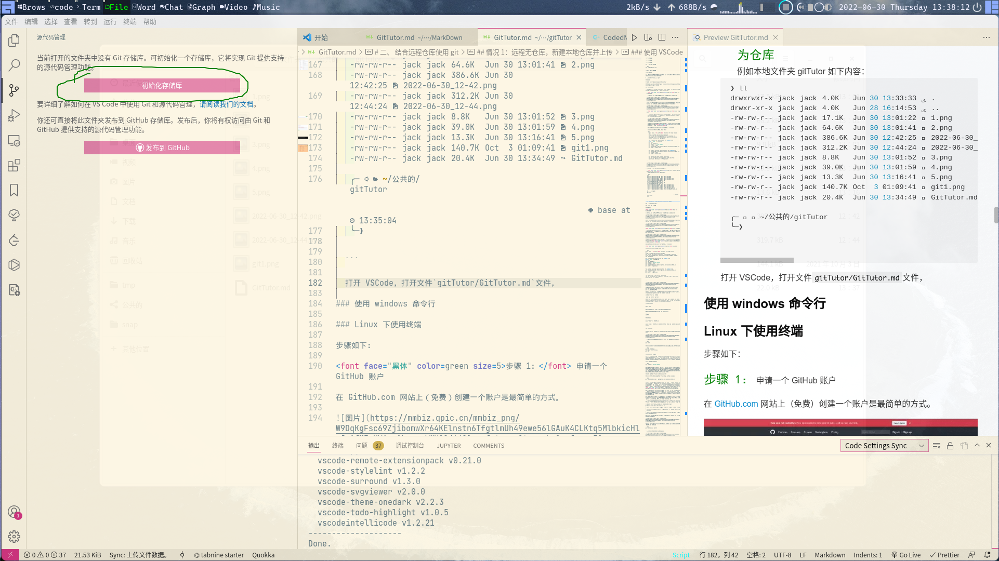

  点击完后如下图：

  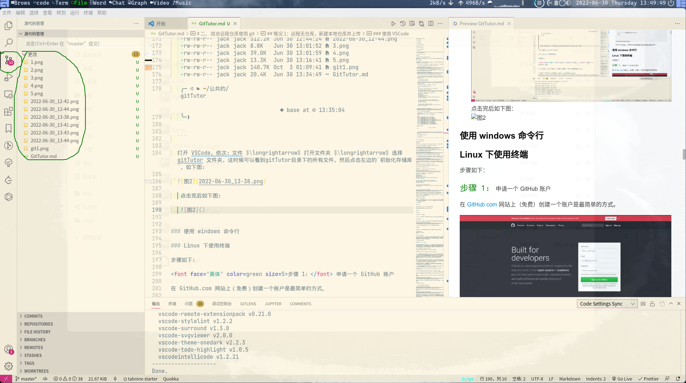

  然后选择 `添加远程仓库`
  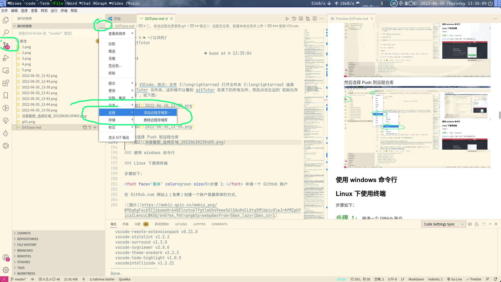

  选择`从GitHub添加远程存储库`
  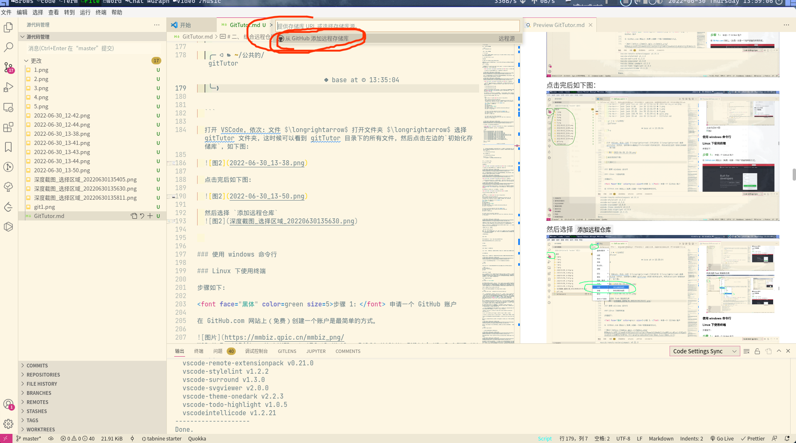

  选择`https://github.com/junjiecjj/gitTutor`
  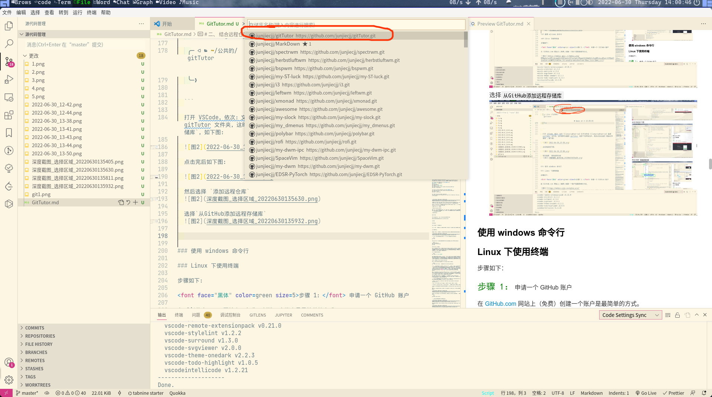

  此时回车，会让你选择远程仓库的名称，输入 origin。
  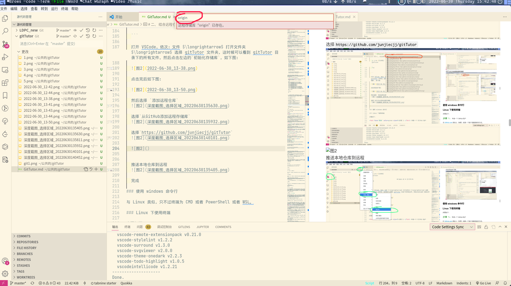

  `从GitHub添加远程存储库`成功，接下来推送。

  推送本地仓库到远程
  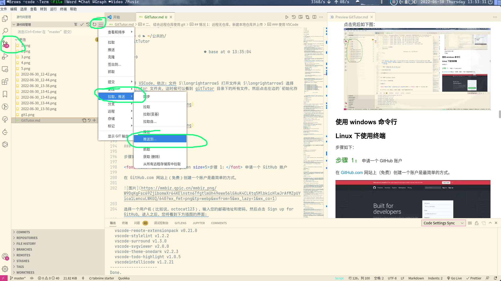

  完成

### 使用 windows 命令行

与 Linux 类似，只不过终端为 CMD 或者 PowerShell 或者 WSL。

### Linux 下使用终端

步骤如下：

<font face="黑体" color=green size=5>步骤 1：</font> 申请一个 GitHub 账户

在 GitHub.com 网站上（免费）创建一个账户是最简单的方式。


选择一个用户名（比如说，octocat123），输入您的邮箱地址和密码，然后点击 Sign up for GitHub。进入之后，您将看到下方插图的界面：


<font face="黑体" color=green size=5>步骤 2：</font>创建一个新的仓库

一个仓库（ repository），类似于能储存物品的场所或是容器；在这里，我们创建仓库存储代码。在 `+` 符号（在插图的右上角，我已经选中它了） 的下拉菜单中选择 New Repository。


给您的仓库命名（比如说，Demo）然后点击 Create Repository，无需考虑本页面的其他选项，<font face="黑体" color=red>特别是千万勾选`Add Readme.md`和`Add .gitignore`</font>。

恭喜！您已经在 GitHub.com 中建立了您的第一个仓库。

<font face="黑体" color=green size=5>步骤 3：</font> 创建文件

当仓库创建完毕后，界面将和下方一致：

```bash
Quick setup — if you’ve done this kind of thing before
or
https://github.com/junjiecjj/Demo.git
Get started by creating a new file or uploading an existing file. We recommend every repository include a README, LICENSE, and .gitignore.

…or create a new repository on the command line
echo "# Demo" >> README.md
git init
git add README.md
git commit -m "first commit"
git branch -M main
git remote add origin https://github.com/junjiecjj/Demo.git
git push -u origin main


…or push an existing repository from the command line
git remote add origin https://github.com/junjiecjj/Demo.git
git branch -M main
git push -u origin main


…or import code from another repository
You can initialize this repository with code from a Subversion, Mercurial, or TFS project.


```


上面的`git remote add origin https://github.com/junjiecjj/Demo.git`改为`git remote add origin git@github.com:junjiecjj/Demo.git`，原因下面会阐述。

不必惊慌，它比看上去简单。跟紧步骤。忽略其他内容，注意截图上的 “...or create a new repository on the command line,”。

在您的计算机中打开终端。

`sudo apt install git-all`

键入 `git` 然后回车。如果命令行显示 `bash: git: command not found`，在您的操作系统或发行版 安装 Git 命令。键入 `git` 并回车检查是否成功安装；如果安装成功，您将看见大量关于使用该命令的说明信息。

在终端内输入：

```
mkdir Demo
```

这个命令将会创建一个名为 Demo 的目录（文件夹）。

如下命令将会切换终端目录，跳转到 Demo 目录：

```
cd Demo
```

然后输入：

```
echo "#Demo" >> README.md
```

创建一个名为 `README.md` 的文件，并写入 `#Demo`。检查文件是否创建成功，请输入：

```
cat README.md
```

这将会为您显示 `README.md` 文件的内容，如果文件创建成功，您的终端会有如下显示：


使用 Git 程序告诉您的电脑，Demo 是一个被 Git 管理的目录，请输入：

```bash
git init
```

然后，告诉 Git 程序您关心的文件并且想在此刻起跟踪它的任何改变，请输入：

```bash
git add README.md
#或者提交所有更改文件到
git add .
```

步骤 4：创建一次提交

目前为止，您已经创建了一个文件，并且已经通知了 Git，现在，是时候创建一次提交 commit 了。提交可以看作是一个里程碑。每当完成一些工作之时，您都可以创建一次提交，保存文件当前版本，这样一来，您可以返回之前的版本，并且查看那时候的文件内容。无论何时您修改了文件，都可以对文件创建一个上一次的不一样的新版本。

创建一次提交，请输入：

```bash
git commit -m "first commit"
```

就是这样！刚才您创建了包含一条注释为 “first commit” 的 Git 提交。每次提交，您都必须编辑注释信息；它不仅能协助您识别提交，而且能让您理解此时您对文件做了什么修改。这样到了明天，如果您在文件中添加新的代码，您可以写一句提交信息：“添加了新的代码”，然后当您一个月后回来查看提交记录或者 Git 日志（即提交列表），您还能知道当时的您在文件夹里做了什么。

步骤 5: 将您的计算机与 GitHub 仓库相连接

现在，是时候用如下命令将您的计算机连接到 GitHub 仓库了：

```bash
git remote add origin   git@github.com:junjiecjj/Demo.git
```

让我们一步步的分析这行命令。我们通知 Git 去添加一个叫做 `origin` （起源）的，拥有地址为 `git@github.com:junjiecjj/Demo.git`（它也是您的仓库的 GitHub 地址） 的 `remote` （远程仓库）。当您提交代码时，这允许您在 GitHub.com 和 Git 仓库交互时使用 `origin` 这个名称而不是完整的 Git 地址。为什么叫做 `origin`？当然，您可以叫点别的，只要您喜欢（惯例而已），<font face="黑体" color=red>注意要用`git@github.com:junjiecjj/Demo.git`</font>而不是`https://github.com/junjiecjj/Demo.git`。

因为用`git@github.com:junjiecjj/Demo.git`相当于用 ssh 登录 github，而`https://github.com/junjiecjj/Demo.git`是用 http 登录，在 push 时 ssh 登录设置免密登录后再使用`git push origin master`非常方便，但是 http 需要生成一个 GitHub token（非常不好用，需要定期更新，每次 push 需要手动输入密码）。

你也许还注意到，GitHub 给出的地址不止一个，还可以用`https://github.com/michaelliao/gitskills.git`这样的地址。实际上，Git 支持多种协议，默认的`git://`使用 ssh，但也可以使用`https`等其他协议。

使用`https`除了速度慢以外，还有个最大的麻烦是每次推送都必须输入口令，但是在某些只开放 http 端口的公司内部就无法使用`ssh`协议而只能用`https`。

> 要关联一个远程库，使用命令`git remote add origin git@server-name:path/repo-name.git`；
>
> 关联一个远程库时必须给远程库指定一个名字，`origin`是默认习惯命名；
>
> 关联后，使用命令`git push -u origin master`第一次推送 master 分支的所有内容；
>
> 此后，每次本地提交后，只要有必要，就可以使用命令`git push origin master`推送最新修改；

现在，我们已经将本地 Demo 仓库副本`连接`到了其在 GitHub.com 远程副本上。您的终端看起来如下：


此刻我们已经连接到远程仓库，可以推送我们的代码 到 GitHub.com（例如上传 `README.md` 文件）。

```bash
git push origin master
```

执行完毕后，您的终端会显示如下信息：


然后，如果您访问 `https://github.com/<your_username>/Demo`，您会看到截图内显示的情况：


就是这么回事！您已经创建了您的第一个 GitHub 仓库，连接到了您的电脑，并且从你的计算机推送（或者称：上传）一个文件到 GitHub.com 名叫 Demo 的远程仓库上了。下一次，我将编写关于 Git 复制（从 GitHub 上下载文件到你的计算机上）、添加新文件、修改现存文件、推送（上传）文件到 GitHub。

以上过程代码如下：

```bash
╭─jack@unix ~/公共的/gitlearn
╰─➤  cd Demo
╭─jack@unix ~/公共的/gitlearn/Demo
╰─➤  echo "#Demo" >> README.md
╭─jack@unix ~/公共的/gitlearn/Demo
╰─➤  git init
已初始化空的 Git 仓库于 /home/jack/公共的/gitlearn/Demo/.git/
╭─jack@unix ~/公共的/gitlearn/Demo  ‹master*›
╰─➤  git add .
╭─jack@unix ~/公共的/gitlearn/Demo  ‹master*›
╰─➤  git commit -m "first commit"
[master （根提交） 9acc47a] first commit
 1 file changed, 1 insertion(+)
 create mode 100644 README.md
╭─jack@unix ~/公共的/gitlearn/Demo  ‹master›
╰─➤  git remote add origin   git@github.com:junjiecjj/Demo.git
╭─jack@unix ~/公共的/gitlearn/Demo  ‹master›
╰─➤  git push origin master
枚举对象: 3, 完成.
对象计数中: 100% (3/3), 完成.
写入对象中: 100% (3/3), 215 字节 | 215.00 KiB/s, 完成.
总共 3（差异 0），复用 0（差异 0），包复用 0
To github.com:junjiecjj/Demo.git
 * [new branch]      master -> master

 #远程仓库更改时用此命令将远程仓库拖到本地
┌─[jack@unix] - [~/公共的/gitlearn/Demo] - [2021-09-11 03:45:36]
└─[0] <git:(master d24144d) > git pull origin master
warning: 不建议在没有为偏离分支指定合并策略时执行 pull 操作。 您可以在执行下一次
pull 操作之前执行下面一条命令来抑制本消息：

  git config pull.rebase false  # 合并（缺省策略）
  git config pull.rebase true   # 变基
  git config pull.ff only       # 仅快进

您可以将 "git config" 替换为 "git config --global" 以便为所有仓库设置
缺省的配置项。您也可以在每次执行 pull 命令时添加 --rebase、--no-rebase，
或者 --ff-only 参数覆盖缺省设置。

来自 github.com:junjiecjj/Demo
 * branch            master     -> FETCH_HEAD
已经是最新的。
┌─[jack@unix] - [~/公共的/gitlearn/Demo] - [2021-09-11 03:45:51]
└─[0] <git:(master d24144d) >


# 新建/删除 目录
┌─[jack@unix] - [~/公共的/gitlearn/Demo] - [六 9月 11, 16:09]
└─[$] <git:(master)> mkdir dic
┌─[jack@unix] - [~/公共的/gitlearn/Demo] - [六 9月 11, 16:09]
└─[$] <git:(master)> cd dic
┌─[jack@unix] - [~/公共的/gitlearn/Demo/dic] - [六 9月 11, 16:09]
└─[$] <git:(master)> echo "hekkhdkda tetst" >> 1.txt
┌─[jack@unix] - [~/公共的/gitlearn/Demo/dic] - [六 9月 11, 16:10]
└─[$] <git:(master*)> cd ..
┌─[jack@unix] - [~/公共的/gitlearn/Demo] - [六 9月 11, 16:10]
└─[$] <git:(master*)> ll
总用量 28K
drwxrwxr-x 4 jack jack 4.0K  9月 11 16:09 ./
drwxrwxr-x 4 jack jack 4.0K  9月 11 00:48 ../
drwxrwxr-x 2 jack jack 4.0K  9月 11 16:10 dic/
drwxrwxr-x 8 jack jack 4.0K  9月 11 16:09 .git/
-rw-rw-r-- 1 jack jack   13  9月 11 14:40 README1.md
-rw-rw-r-- 1 jack jack   13  9月 11 15:03 README2.md
-rw-rw-r-- 1 jack jack    6  9月 11 00:21 README.md
┌─[jack@unix] - [~/公共的/gitlearn/Demo] - [六 9月 11, 16:10]
└─[$] <git:(master*)> git add .
┌─[jack@unix] - [~/公共的/gitlearn/Demo] - [六 9月 11, 16:10]
└─[$] <git:(master*)> git commit -m "add dir dic"
[master cd66fdc] add dir dic
 1 file changed, 1 insertion(+)
 create mode 100644 dic/1.txt
┌─[jack@unix] - [~/公共的/gitlearn/Demo] - [六 9月 11, 16:10]
└─[$] <git:(master)> git push origin master
枚举对象: 5, 完成.
对象计数中: 100% (5/5), 完成.
使用 8 个线程进行压缩
压缩对象中: 100% (2/2), 完成.
写入对象中: 100% (4/4), 318 字节 | 318.00 KiB/s, 完成.
总共 4（差异 1），复用 0（差异 0），包复用 0
remote: Resolving deltas: 100% (1/1), completed with 1 local object.
To github.com:junjiecjj/Demo.git
   240a168..cd66fdc  master -> master
┌─[jack@unix] - [~/公共的/gitlearn/Demo] - [六 9月 11, 16:10]
└─[$] <git:(master)> rm -rf dic
┌─[jack@unix] - [~/公共的/gitlearn/Demo] - [六 9月 11, 16:10]
└─[$] <git:(master*)> git add .
┌─[jack@unix] - [~/公共的/gitlearn/Demo] - [六 9月 11, 16:10]
└─[$] <git:(master*)> git commit -m "del dir dic"
[master 022cd18] del dir dic
 1 file changed, 1 deletion(-)
 delete mode 100644 dic/1.txt
┌─[jack@unix] - [~/公共的/gitlearn/Demo] - [六 9月 11, 16:10]
└─[$] <git:(master)> git push origin master
枚举对象: 3, 完成.
对象计数中: 100% (3/3), 完成.
使用 8 个线程进行压缩
压缩对象中: 100% (2/2), 完成.
写入对象中: 100% (2/2), 217 字节 | 217.00 KiB/s, 完成.
总共 2（差异 1），复用 0（差异 0），包复用 0
remote: Resolving deltas: 100% (1/1), completed with 1 local object.
To github.com:junjiecjj/Demo.git
   cd66fdc..022cd18  master -> master
┌─[jack@unix] - [~/公共的/gitlearn/Demo] - [六 9月 11, 16:10]
└─[$] <git:(master)>


```

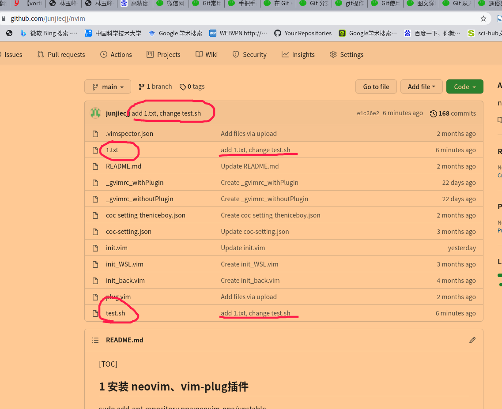

## 情况 2：远程仓库已有内容，下载并使用远程仓库

# 三、仅在本地使用 Git

一般如果仅在本地使用 Git，则：

认真看完以上内容后就知道，仅在本地使用 Git 是上述内容的阉割版，在此不在赘述。
